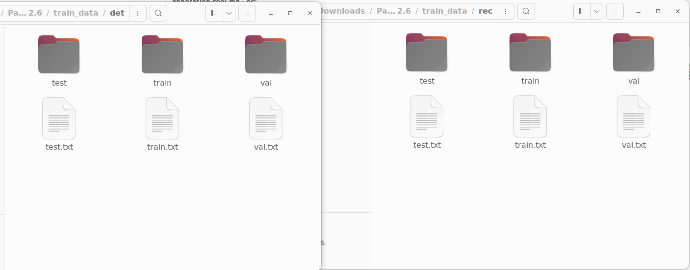

For data labeling purpose we have used PPOCRLabel tool (https://github.com/PaddlePaddle/PaddleOCR/tree/release/2.6/PPOCRLabel). Tool also included in code part. You can either view video tutorial or you can refer doc link for exploring labeling process.

[Video tutorial link](https://youtu.be/XRaY6yNjuvs){:target="_blank" rel="noopener"}

## Splitting dataset:

  Once you are ready with annotations you can export label and recognition result, that we need to split into train, validation and test set for ocr training or fine-tuning.

  You can use modified `gen_ocr_train_val_test.py` file to split dataset,that will contains relative filepath in label file, so we can use that file for training on new system easily. [download code file](../assets/dataset_preparation/gen_ocr_train_val_test.py "download"){:target="_blank" rel="noopener"}

```python title="gen_ocr_train_val_test.py"
--8<-- "docs/assets/dataset_preparation/gen_ocr_train_val_test.py"
```

After splitting annotated dataset it will create training, validation and testing folder with associated labels.

[  ](../assets/dataset_preparation/folder-label-file-structure-after-splitting-annotated-dataset.png)