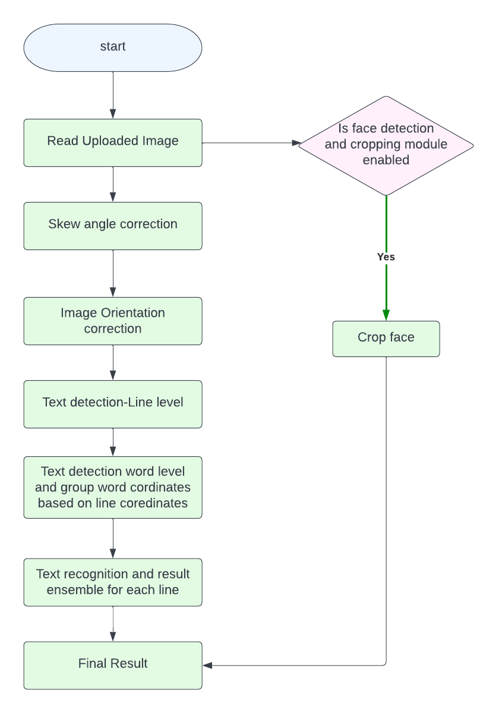

# Introduction

OCR (optical character recognition) is the use of technology to distinguish printed or handwritten text characters inside digital images of physical documents, such as a scanned paper document. The basic process of OCR involves examining the text of a document and translating the characters into code that can be used for data processing. OCR is sometimes also referred to as text recognition.

## Used OCR Engines:

1. [PaddleOCR](https://github.com/PaddlePaddle/PaddleOCR)
2. [EasyOCR](https://github.com/JaidedAI/EasyOCR)
3. [MMOCR](https://github.com/open-mmlab/mmocr)
4. [TesseractOCR](https://github.com/tesseract-ocr/tesseract)

We have fine-tuned paddleocr and easyocr models.

## modules:

1. Image Skew correction
2. Image orientation correction
3. Text detection
4. Text recognition
5. Structured data

## System Flow:

