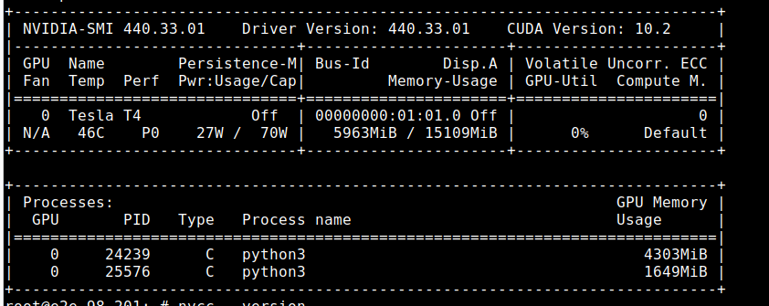
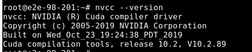

# Installation

## A) Server requirements:

### Hardware:
1. CPU cores(4 plus)
2. RAM (8 GB plus)
3. SSD storage: 100 GB
4. GPU card(atleast 4GB memory)

### Software:
1. Ubuntu 18 / Ubuntu 20
2. CUDA 10.2 / CUDA 11.6 with cuda compiler 
3. Python3

### Sample result after running `nvidia-smi` command:




### Sample result after running `nvcc --version` command:




## Installation:

1. From pip package:
   Unzip OCR zipped file, goto main folder, and run `pip install -r requirements.txt`

2. Docker:

    Command to build:

    ```sudo docker build . -t ocr:latest```

    Run : 

    ```sudo docker run -p 5000:5000 --gpus all --init -it ocr```